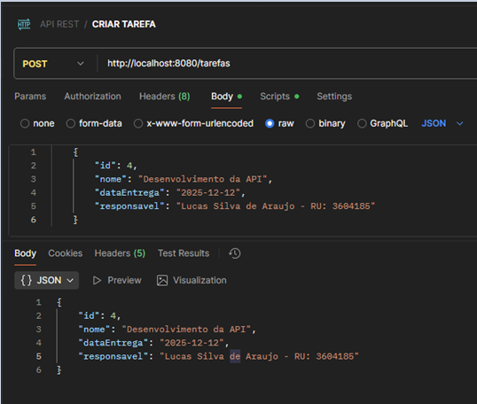

# API RESTful de gerenciamento de tarefas (Task Manager API)

## 🧰 Tecnologias utilizadas

- Java  
- Spring Boot  
- Maven  
- Postman


## 🚀 Como rodar localmente

##  1. Clone este repositório:
```bash
   git clone https://github.com/lucassilvaaraujo98/demorest.git
   cd demorest
````
### 2. Certifique-se de ter Java (versão compatível) e Maven instalados.
### 3. Configure as variáveis de ambiente ou arquivos de configuração (por exemplo, application.properties ou application.yml) — banco de dados, porta, credenciais etc.
### 4. Execute o Main (DemorestApplication.java).
### 5. A API estará disponível em http://localhost:8080.
## 6. Configure o Postman.
Métodos HTTP para serem usados no Postman:

| Método HTTP | Endpoint    | Descrição                  |
| ----------- | ----------- | -------------------------- |
| GET         | /tarefas      | Listar todas as tarefas    |
| GET         | /tarefas/{id} | Obter uma tarefa por ID    |
| POST        | /tarefas      | Criar nova tarefa          |
| PUT         | /tarefas/{id} | Atualizar tarefa existente |
| DELETE      | /tarefas/{id} | Remover tarefa             |

# Exemplo de uso de Método HTTP:



